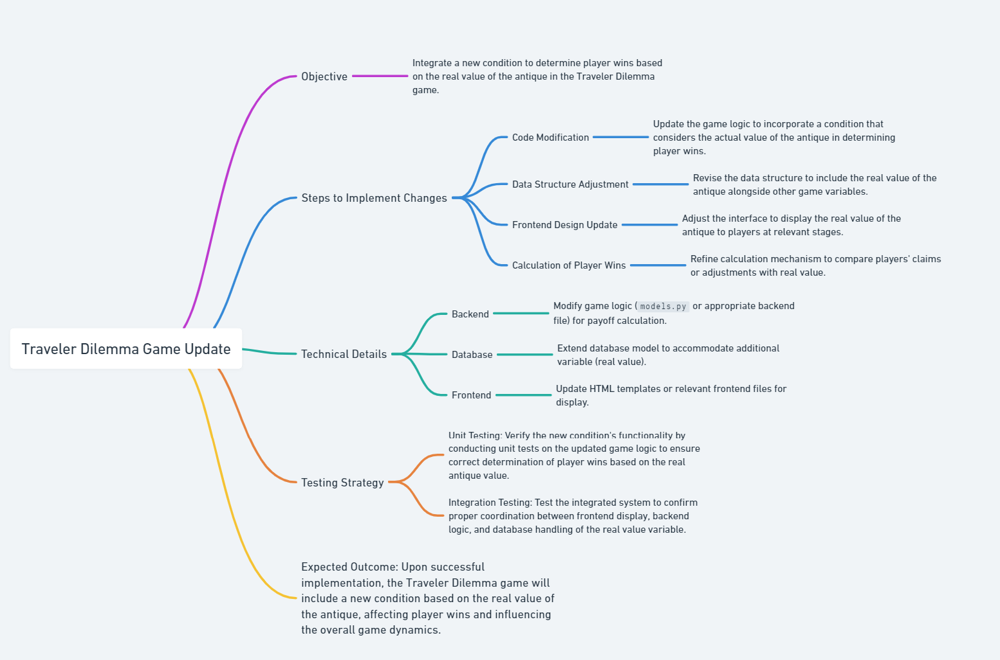

# ECON211_Yiwei_Week4_Ref
## Description
- In the augmented version of The Traveler's Dilemma, players not only strive to outguess their opponents in the pricing game but must also accurately estimate the genuine value of the antique. Basu's work on rationality in game theory highlights how introducing real-value assessment alters strategic thinking ("The Traveler's Dilemma: Paradoxes of Rationality in Game Theory," Basu, 1994). This addition complicates decision-making, demanding a nuanced balance between competitive pricing and an insightful evaluation of the antique's worth. The game's dynamics expand to integrate a dual challenge, emphasizing the interplay of strategic reasoning and accurate valuation.
- 
# Citation
```
@article{basu1994traveler,
  title={The traveler's dilemma: Paradoxes of rationality in game theory},
  author={Basu, Kaushik},
  journal={The American Economic Review},
  volume={84},
  number={2},
  pages={391--395},
  year={1994},
  publisher={JSTOR}
}
```